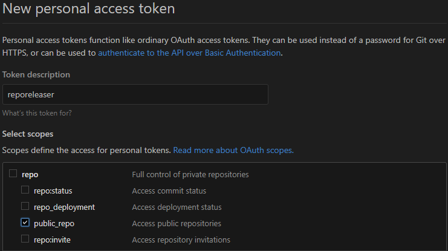

# reporeleaser [](https://travis-ci.com/ludeeus/reporeleaser)

_Create a new release for your repository, with a commit changelog._  

This will create a new release for your repository.  
In the description of that release it will list all commits since the last release.

## Installation

```bash
python3 -m pip install -U reporeleaser
```

# Example usage

```bash
reporeleaser --token aaabbbccc111222333 --repo reporeleaser --release minor
```

This example will create a new release for `reporeleaser` with this information:

**Tag name:** `0.1.0`

**Release name:** `0.1.0`

**Release description:**

```markdown
## Changes

- Use regex to find previous tag
- Fix error handing for missing regex match
- Split code into multiple methods
- Create default tag_sha for last_release
- Add failsafe for new_commits
- use username and not name
- Use login not username
- correct versioning for major / minor

[Full Changelog][changelog]

***

This release was created with [reporeleaser][reporeleaser] :tada:

[reporeleaser]: https://pypi.org/project/reporeleaser/
[changelog]: https://github.com/ludeeus/reporeleaser/compare/0.0.4...0.1.0
```

**NB!: it is recommended to run it one time with [`--test`](#option---test) option to make sure the data is correct.**

# CLI options

## option `--token`

A personal access token for your GitHub account.  
This token **needs** access to all `repo` scopes.

You can create a new token in the [Developer settings](https://github.com/settings/tokens/new).



_You should have 1 token pr integration you use._

**Example:** `--token aaabbbccc111222333`

## option `--repo`

The name of the repository you are creating a release for.  
The structure needs to be `ludeeus/reporeleaser`, if this repository are on your user
account, you can just use `reporeleaser`.

**Examples:**  

- `--repo ludeeus/reporeleaser`
- `--repo reporeleaser`

## option `--release`

This is the type of release you are doing, this will be used to create the new tag with the correct version number.

Possible values:

- `major`
- `minor`
- `patch`

If you do not follow this schema for you tags you can use a custom one.

**Example:** `--release patch`

**Example for custom:** `--release v.1.1.1`

## option `--test`

_This option is a flag._

When this is enabled, a release will **not** be created/published.

This will print to the console how the release will look, giving you a chance to look things over.

## option `--draft`

_This option is a flag._

This creates a release draft instead of publishing the release, this can be useful if you need to add more/change the text in the release description.

## option `--show_sha`

_This option is a flag._

When this is enabled every commit line in the release description will be prefixed by the first 7 characters in the sha, which GitHub turns in to a link to that commit.

An example of this can be seen here [https://github.com/ludeeus/reporeleaser/releases/tag/0.3.0](https://github.com/ludeeus/reporeleaser/releases/tag/0.3.0)

## option `--title`

The name you want to use for your release, this defaults to the tag name.

_If your name contains spaces you **need** to add quotes around it._

**Example:** `--title "My Release Title`

## option `--hide_footer`

_This option is a flag._

By default this will be added to the bottom of every release created with this tool.

```markdown
***

This release was created with [reporeleaser][reporeleaser] :tada:

[reporeleaser]: https://pypi.org/project/reporeleaser/
```

You create releases for your projects, so you should be in control, but it's much appreciated if you leave this in.

By enabling this flag, this will not be added.

## option `--hide_full_changelog`

_This option is a flag._

By default this will be added to the bottom of every release created with this tool.  
The link will automatically be updated to match the repository and the correct diff for this release.

```markdown
[Full Changelog][changelog]

[changelog]: https://github.com/ludeeus/reporeleaser/compare/1.0.0...1.1.0
```

By enabling this flag, this will not be added.

## option `--version`

_This option is a flag._

Prints the installed version of `reporeleaser`.

## option `--help`

Show available options.

***

[](https://www.buymeacoffee.com/ludeeus)